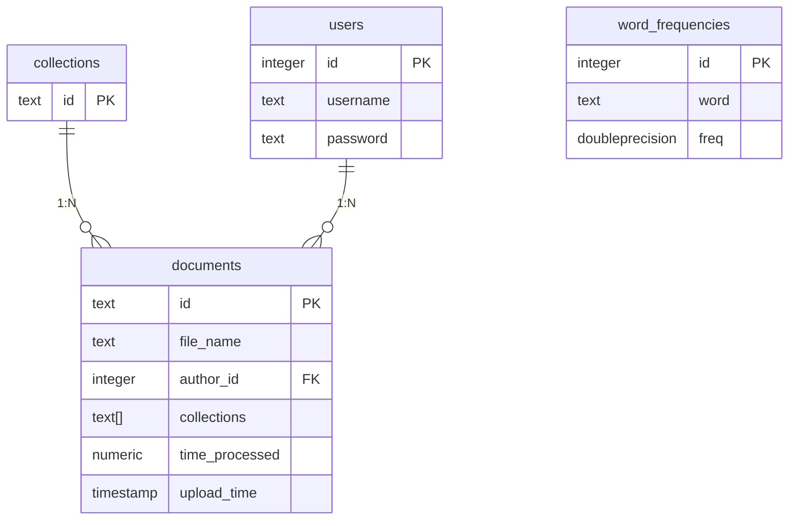

# Структура таблиц базы данных

```mermaid
erDiagram
    collections ||--o{ documents : "1:N"
    users ||--o{ documents : "1:N"

    collections {
        text id PK
    }

    documents {
        text id PK
        text file_name
        integer author_id FK
        text[] collections
        numeric time_processed
        timestamp upload_time
    }

    users {
        integer id PK
        text username
        text password
    }

    word_frequencies {
        integer id PK
        text word
        doubleprecision freq
    }
```
